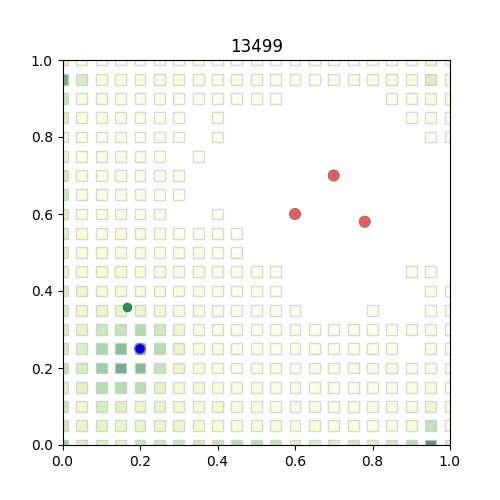

# Force Field Environment

Green: Agent  
Blue: attractor  
Red: repulsors  

Agent state: (x, y, Vx, Vy)
Agent action: (Fx, Fy) # suggest to be between -1 to 1

How to use: Please see `env_ForceField_demo.py`  
See `env_ForceField.py` for more parameter details

